# 🚀 Trabalho Final - Infraestrutura Automatizada

**Pedro Henrique Barros Vieira**

**Matrícula: 2517254**

## 📋 Descrição do Projeto

Este projeto demonstra a automação completa de infraestrutura utilizando **Terraform** para provisionamento de uma instância EC2 na AWS e **Ansible** para configuração de serviços, atualização dos pacotes do servidor e disponibilização da página web customizada.

O objetivo é criar uma instância EC2 Ubuntu na AWS e configurar um servidor Apache com uma página web personalizada.

## 🏗️ Arquitetura

- **Cloud Provider**: AWS
- **Compute**: EC2 Ubuntu Server 24.04
- **Web Server**: Apache2
- **IaC**: Terraform + Ansible
- **Automação**: apt update/upgrade + configuração completa via Ansible

## Estrutura do Projeto

```plaintext
TrabFinal/
├── terraform/           # Infraestrutura como código
│   ├── main.tf
│   ├── variables.tf
│   ├── backend.tf
│   ├── terraform.tfvars
├── ansible/            # Configuração e automação
│   ├── playbook.yml
│   └── inventory.yml
├── site/              # Página web
│   └── index.html
└── ReadMe.md
```

---

## 🚀 Como Executar

### **Pré-requisitos**

```bash
# Terraform instalado
terraform --version

# Ansible instalado
ansible --version

# AWS CLI configurado com credenciais
aws configure
```

### **Passo 1: Provisionar Infraestrutura com Terraform**

```bash
# Navegar para pasta terraform
cd terraform

# Inicializar Terraform
terraform init

# Planejar recursos
terraform plan

# Aplicar configuração (criar EC2)
terraform apply
# Digite 'yes' quando solicitado

# Verificar IP da instância criada
terraform output ec2_public_ip
```

### **Passo 2: Configurar Servidor com Ansible**

```bash
# Navegar para pasta ansible
cd ../ansible

# Executar playbook (instalar Apache + configurações)
ansible-playbook -i inventory.yml playbook.yml

# Aguarde a execução completar (~2-3 minutos)
```

### **Passo 3: Acessar Aplicação**

```bash
# Obter IP público da instância
cd ../terraform
terraform output ec2_public_ip

# Acessar no navegador:
# http://SEU_IP_AQUI
```

---

### ⚙️ O que o Ansible Executa

O playbook `ansible/playbook.yml` realiza as seguintes tarefas:

1. ✅ **apt update** - Atualiza cache de pacotes (executado como root)
2. ✅ **apt upgrade** - Atualiza todos os pacotes do sistema para versões mais recentes
3. ✅ **Instalação Apache2** - Instala servidor web
4. ✅ **Configuração do Apache** - Inicia e habilita o serviço
5. ✅ **Deploy da página** - Copia `site/index.html` para `/var/www/html/`
6. ✅ **Configuração de Firewall** - Libera portas 80 (HTTP) e 443 (HTTPS)
7. ✅ **Validação** - Verifica status do Apache
8. ✅ **Arquivo de validação** - Cria arquivo de log da execução

### 🌐 Resultado Final

Após a execução completa, você terá:

- ✅ **EC2 Ubuntu** provisionado via Terraform
- ✅ **Apache2** instalado e configurado via Ansible
- ✅ **Página web personalizada** acessível em `http://IP_DA_INSTANCIA`
- ✅ **Firewall configurado** para permitir tráfego HTTP/HTTPS
- ✅ **Automação completa** sem intervenção manual

---

## Provisionamento da Máquina via Terraform

Para a criação da máquina via Terraform, foi utilizada a separação em 4 arquivos `.tf`, conforme detalhado na seção [Estrutura do Projeto](#estrutura-do-projeto). Existe a possibilidade de utilizar apenas um arquivo (`main.tf`), mas foi escolhida essa abordagem para facilitar a organização e as funções específicas de cada parte do Terraform.

### variables.tf

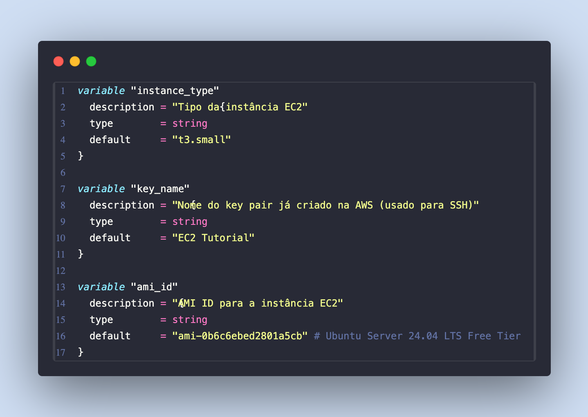

Para o provisionamento da máquina, foram utilizadas três variáveis para armazenar seus valores e não deixá-los visíveis no `main.tf`. São elas:

- **`instance_type`** - Define o tipo/tamanho da instância EC2 (t3.small). Controla recursos como CPU, memória e performance da máquina virtual.

- **`key_name`** - Especifica o nome do key pair SSH já existente na AWS ("EC2 Tutorial"). Necessário para acessar a instância remotamente via SSH de forma segura.

- **`ami_id`** - Identifica a Amazon Machine Image (Ubuntu Server 24.04 LTS). Define qual sistema operacional e configuração base será utilizada para criar a instância.

### terraform.tfvars

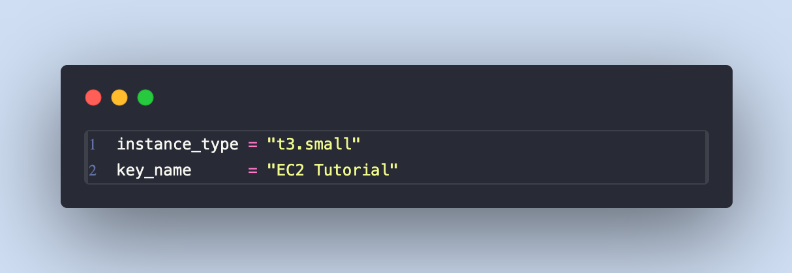

O arquivo `terraform.tfvars` é usado para definir valores específicos para as variáveis declaradas no [variables.tf](#variablestf), permitindo maior flexibilidade e segurança na configuração.

**Abordagens possíveis:**

1. **Com valores `default`** (abordagem atual): As variáveis já possuem valores padrão definidos no `variables.tf`, tornando o `.tfvars` opcional.

2. **Sem valores `default`**: Remover os valores padrão do `variables.tf` e definir todos os valores obrigatoriamente no `.tfvars`.

**Vantagens do `.tfvars`:**

- ✅ Separação entre definição (variables.tf) e configuração (tfvars)
- ✅ Possibilidade de ter múltiplos arquivos para diferentes ambientes (dev.tfvars, prod.tfvars)
- ✅ Facilita mudanças de configuração sem editar o código principal
- ✅ Pode ser excluído do Git para manter credenciais seguras

### backend.tf

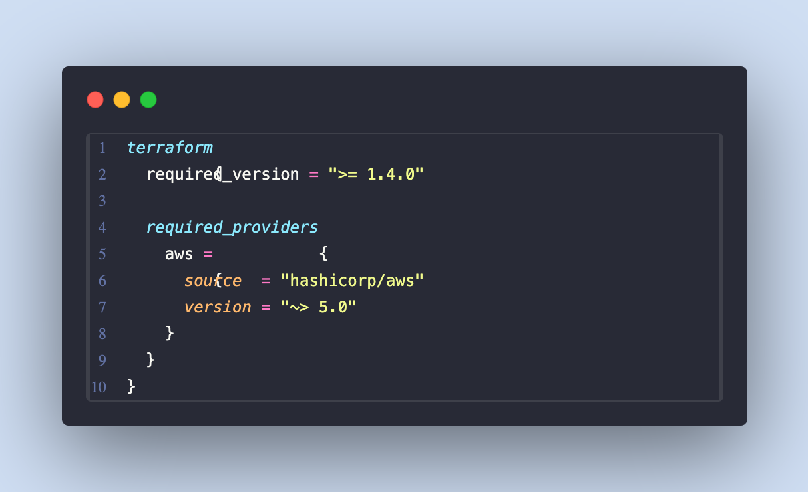

O arquivo `backend.tf` define as configurações fundamentais do Terraform, especificando versões e provedores necessários para o projeto.

**Explicação linha por linha:**

- **`required_version = ">= 1.4.0"`** - Define a versão mínima do Terraform necessária (1.4.0 ou superior). Garante compatibilidade com recursos e funcionalidades específicas.

- **`required_providers`** - Bloco que especifica quais provedores externos são necessários para o projeto.

- **`aws = { ... }`** - Configuração específica do provedor AWS:
  - **`source = "hashicorp/aws"`** - Define a origem oficial do provider AWS no Terraform Registry
  - **`version = "~> 5.0"`** - Especifica versão compatível (~> 5.0 significa >= 5.0.0 e < 6.0.0), garantindo estabilidade sem quebrar compatibilidade

**Importância:**

- ✅ Garante reprodutibilidade do ambiente
- ✅ Evita conflitos de versão entre equipe
- ✅ Define dependências explicitamente
- ✅ Facilita troubleshooting e manutenção

### main.tf

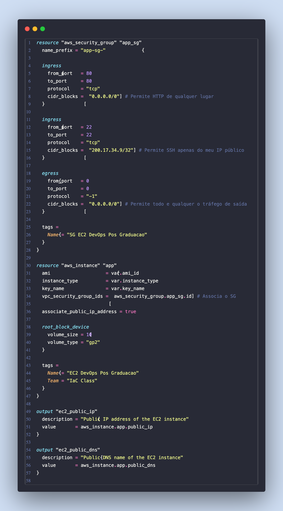

O arquivo principal do Terraform contém a definição completa da infraestrutura, nesse caso, dividido em 3 componentes principais:

1. **Security Group** - Regras de firewall para controle de acesso
2. **Instância EC2** - Configuração do servidor virtual
3. **Outputs** - Informações importantes após o provisionamento

#### Security Group

**Configurações de segurança:**

- **Porta 80 (HTTP)** - Aberta para qualquer origem (0.0.0.0/0) para acesso público ao site
- **Porta 22 (SSH)** - Restrita ao IP específico (200.17.34.9/32) para acesso administrativo seguro
- **Saída** - Permite todo tráfego de saída para atualizações e downloads

#### Instância EC2

**Características da instância:**

- **AMI** - Ubuntu Server 24.04 LTS (definida via variável)
- **Tipo** - t3.small com recursos balanceados (CPU/memória)
- **Storage** - 10GB SSD GP2 para sistema operacional
- **IP Público** - Habilitado para acesso externo
- **Key Pair SSH** - Utiliza par de chaves já existente na AWS ("EC2 Tutorial") para acesso SSH seguro via arquivo `.pem`
- **Security Group** - Vinculado ao SG criado anteriormente

#### Outputs (Informações pós-apply)

**Informações exportadas:**

- **IP Público** - Para acessar diretamente o servidor via HTTP ou SSH
- **DNS Público** - Nome DNS da AWS para acesso alternativo

Essas informações são essenciais para conectar o Ansible e acessar a aplicação web posteriormente.

## Ansible para Configurar e Disponibilizar o Servidor Web

Após o provisionamento da infraestrutura com Terraform, o servidor EC2 é criado com apenas o sistema operacional base (Ubuntu Server 24.04). Para transformá-lo em um servidor web funcional, é necessário realizar diversas configurações e instalações.

**Por que usar Ansible?**

Embora seja possível configurar o servidor manualmente via SSH, o Ansible oferece várias vantagens fundamentais:

- **⚡ Automação completa** - Elimina configurações manuais e reduz erros humanos
- **🔄 Idempotência** - Executa apenas as mudanças necessárias, garantindo estado consistente
- **📋 Documentação viva** - O playbook serve como documentação executável das configurações
- **🎯 Reprodutibilidade** - Garante que a configuração seja idêntica em qualquer ambiente
- **⏱️ Eficiência** - Execução paralela e otimizada das tarefas

**Separação de responsabilidades:**

- **Terraform** → Provisiona a infraestrutura (EC2, Security Groups, redes)
- **Ansible** → Configura o software e serviços dentro do servidor

**O que seria necessário fazer manualmente sem Ansible:**

1. Conectar via SSH na instância
2. Executar `sudo apt update && sudo apt upgrade`
3. Instalar Apache2 manualmente
4. Configurar o serviço para iniciar automaticamente
5. Fazer upload da página web
6. Configurar firewall (ufw)
7. Testar e validar configurações

Com Ansible, todas essas etapas são automatizadas em um único comando, garantindo consistência e repetibilidade.

### inventory.yml

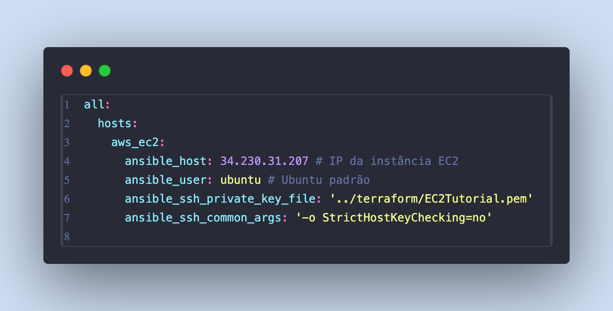

O arquivo `inventory.yml` define os hosts (servidores) onde o Ansible executará as tarefas. É essencialmente a "lista telefônica" do Ansible, especificando como conectar aos servidores remotos.

**Explicação de cada parâmetro:**

- **`all:`** - Grupo principal que contém todos os hosts do inventário
- **`hosts:`** - Seção que define os servidores individuais
- **`aws_ec2:`** - Nome lógico do servidor (pode ser qualquer nome descritivo)

**Configurações de conexão:**

- **`ansible_host: 34.230.31.207`** - IP público da instância EC2 (obtido via output do Terraform)
- **`ansible_user: ubuntu`** - Usuário padrão das instâncias Ubuntu na AWS
- **`ansible_ssh_private_key_file: '../terraform/EC2Tutorial.pem'`** - Caminho para a chave SSH privada
- **`ansible_ssh_common_args: '-o StrictHostKeyChecking=no'`** - Desabilita verificação da chave do host (útil para automação)

### playbook.yml

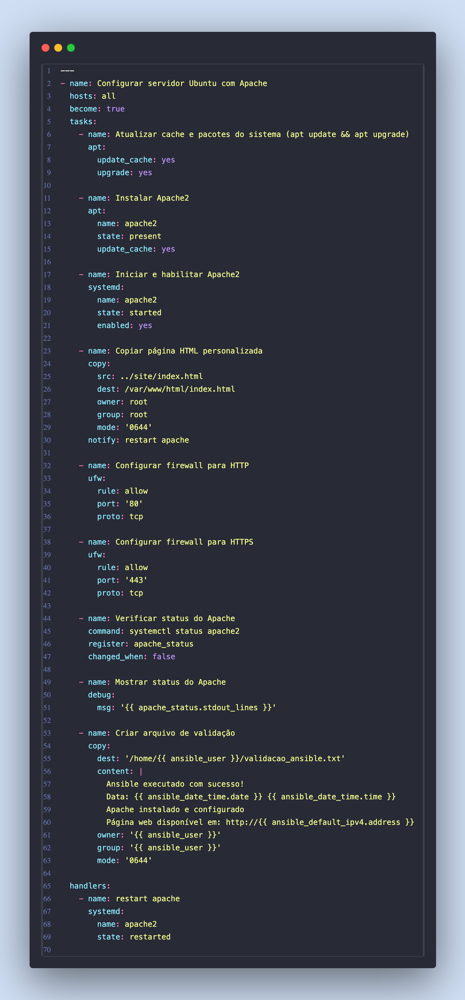

O `playbook.yml` é o arquivo principal do Ansible que define todas as tarefas de automação para configurar o servidor Ubuntu como um servidor web Apache funcional. Ele executa de forma sequencial e idempotente todas as configurações necessárias.

**Estrutura e configuração principal:**

- **`hosts: all`** - Executa em todos os servidores do inventário
- **`become: true`** - Executa comandos com privilégios sudo/root

**Tarefas executadas em sequência:**

**1. Atualização do sistema:**
Atualiza o cache de pacotes e faz upgrade de todos os pacotes instalados para suas versões mais recentes através do módulo `apt`.

**2. Instalação do Apache2:**
Instala o servidor web Apache2 através do gerenciador de pacotes apt, garantindo que o pacote esteja presente no sistema.

**3. Configuração do serviço Apache:**
Inicia o serviço Apache2 e configura para inicializar automaticamente no boot do sistema através do módulo `systemd`.

**4. Deploy da página web:**
Copia a página HTML personalizada do diretório local `../site/index.html` para o diretório web padrão do Apache `/var/www/html/index.html`. Define permissões adequadas (root:root, 0644) e aciona o handler para reiniciar o Apache se houver mudanças.

**5. Configuração do firewall:**
Configura o firewall UFW para permitir tráfego de entrada nas portas 80 (HTTP) e 443 (HTTPS), habilitando acesso público ao servidor web.

**6. Validação do serviço:**
Executa verificação do status do Apache através do comando `systemctl status apache2`, registra o resultado e exibe as informações detalhadas para validação da configuração.

**7. Arquivo de validação:**
Cria um arquivo de log no diretório home do usuário com informações da execução, incluindo timestamp, status da configuração e IP da máquina para acesso web.

**Handler para reinicialização:**
Define um handler que reinicia o serviço Apache2 quando acionado por tasks específicas (como a cópia da página HTML), garantindo que mudanças sejam aplicadas corretamente.

**Características importantes:**

- ✅ **Idempotência** - Pode ser executado múltiplas vezes sem efeitos colaterais
- ✅ **Ordenação lógica** - Tasks seguem sequência lógica de configuração
- ✅ **Validação** - Inclui verificações de status e logs
- ✅ **Handlers** - Reinicia serviços apenas quando necessário
- ✅ **Variáveis dinâmicas** - Usa facts do Ansible para informações do sistema

## Execução da Aplicação

Após as configurações serem realizadas, vamos observar como foram executadas as etapas para subir a infraestrutura e publicar a página web.

### Terraform

Já havia uma infraestrutura criada, com EC2 e demais recursos. Foi executado `terraform destroy` para limpar o ambiente e criar tudo do zero novamente.

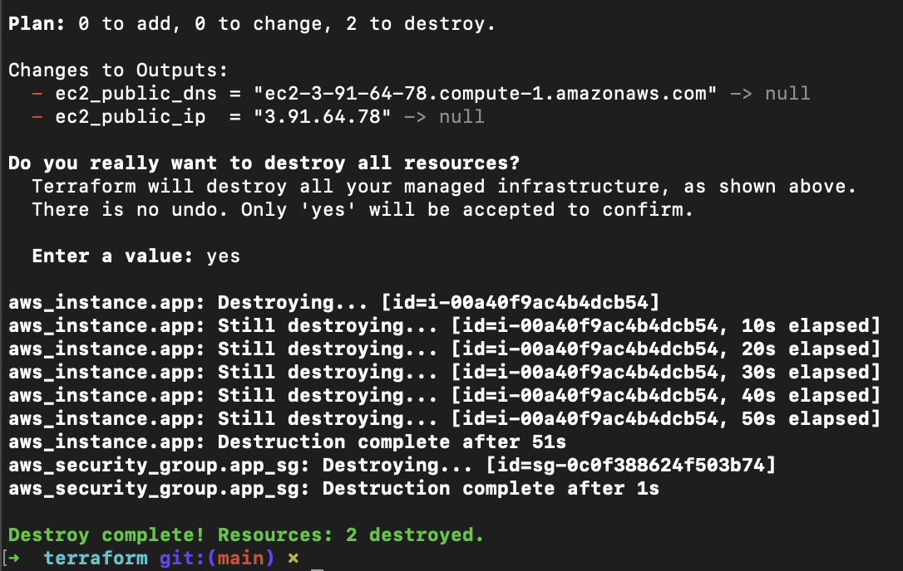

Assim, ao executar um novo `terraform plan`, é realizada a inserção de um novo Security Group e uma nova instância EC2.

Verificando que está tudo correto, ao executar o `terraform apply`, os recursos são criados novamente.

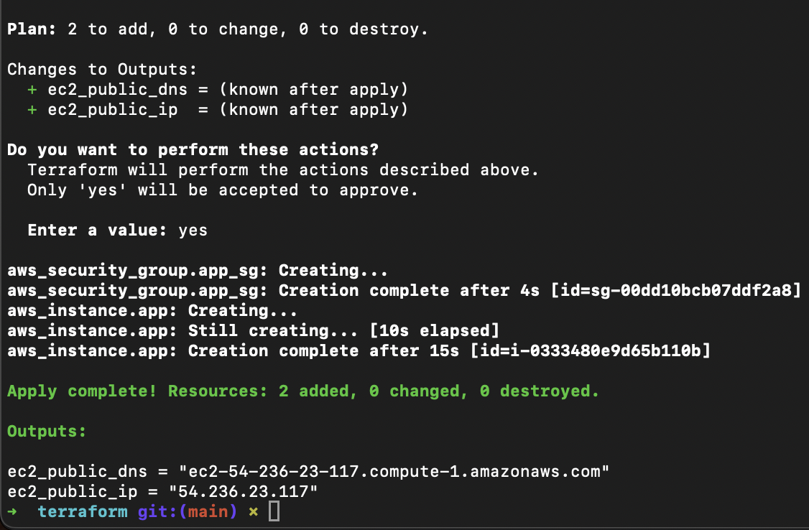

É necessário substituir o IP do EC2 no `inventory.yml` para atualizar a comunicação do Ansible com a instância EC2. Diante do novo IP `54.236.23.117`.

Também foi necessário ajustar o "Meu IP" (IP público na internet da minha máquina) no `main.tf` do Terraform, no Security Group, pois houve mudança de rede. Para que a minha máquina consiga executar o Ansible com sucesso.

Dessa forma, foi necessário executar `terraform plan` e `terraform apply` mais uma vez para atualizar o recurso na AWS a partir dos ajustes realizados na máquina local.

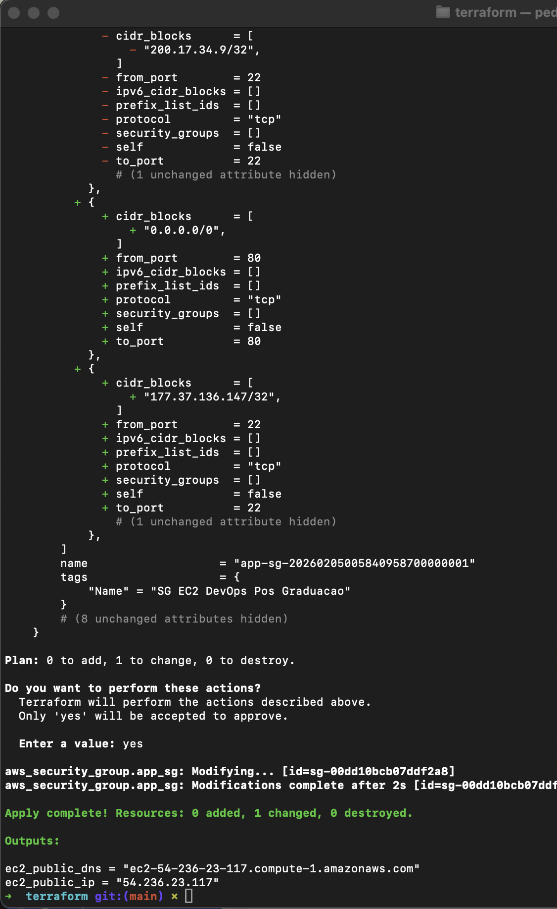

### Ansible

Após as configurações de rede terem sido ajustadas no Terraform:

- Meu IP público, que origina as requisições
- IP do EC2 que é o destino das requisições

É possível executar o Ansible para que todas as etapas do playbook possam ser executadas dentro da instância EC2.

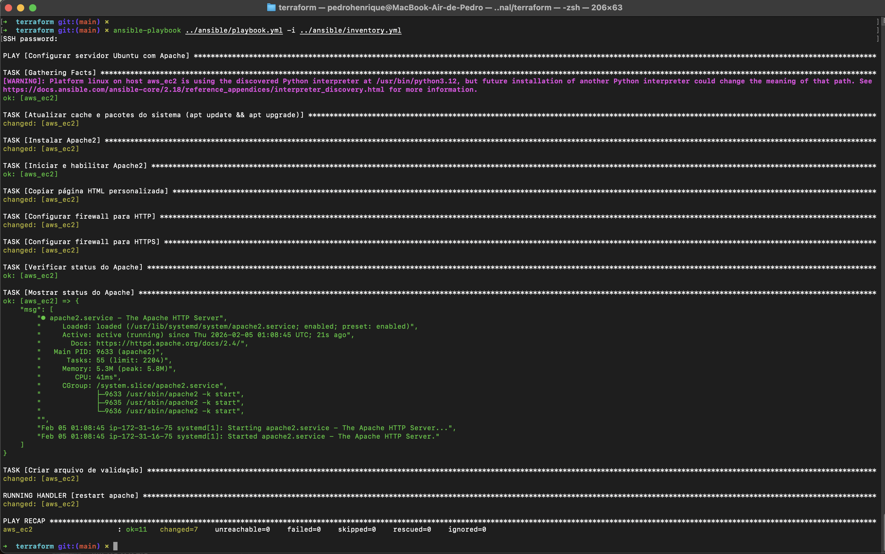

É possível perceber que logo após a execução do comando, é solicitada a `SSH password:`, porém neste caso não é necessário. Passamos dessa etapa apenas pressionando ENTER, pois o acesso ao EC2 não é por senha, e sim através da chave, o arquivo `.pem`, atrelado ao Key Pair do EC2.

## Acessando a Aplicação

Após o Ansible ser concluído, basta inserir o IP do EC2 diretamente na URL do navegador, que o Apache direciona o acesso para o arquivo HTML enviado para o EC2 durante a etapa do Ansible.

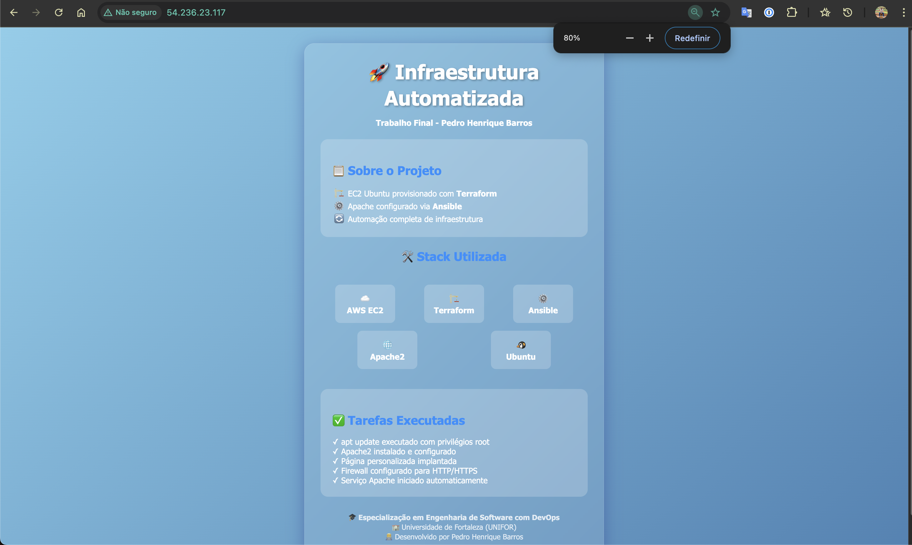

## 👨‍💻 Autor

**Pedro Henrique Barros**  
Especialização em Engenharia de Software com DevOps - UNIFOR
